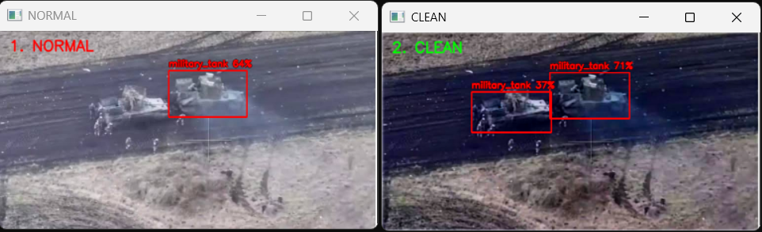

# Military Vision Enhancement & Object Detection Pipeline

[](https://en.cppreference.com/)
[](https://www.python.org/)
[](https://pytorch.org/)
[](https://opencv.org/)
[](https://github.com/ultralytics/ultralytics)

A high-performance computer vision pipeline designed for challenging, low-visibility environments (fog, haze, dust). This system integrates a lightweight **AOD-Net** dehazing model with a **custom PyTorch-trained YOLOv8** model optimized specifically for military tank and combat vehicle detection.

---

## Key Features

- **Custom-Trained YOLOv8 (PyTorch):** Object detection model trained from scratch/fine-tuned using PyTorch on custom military datasets to accurately detect armored tanks, combat vehicles, and tactical units.
- **Two-Stage Adaptive Pipeline:** Integrates a lightweight AOD-Net preprocessing layer for real-time contrast enhancement prior to object detection.
- **Optimized C++ Inference:** Built natively using the **OpenCV DNN module** (`DNN_BACKEND_OPENCV`) running efficiently on CPU, avoiding heavy Python runtime overhead during deployment.
- **Robust Tank & Asset Detection:** Effectively recovers hidden features in extreme weather conditions (fog, dust storms) to reduce false negatives on critical military targets.
- **Before / After Comparison Support:** Includes built-in side-by-side visualization (`result.png`) to analyze how dehazing improves confidence scores and detection boundaries.

---

## Performance & Results

Under heavy atmospheric degradation, the adaptive dehazing preprocessing layer combined with the custom-trained tank detection model yields an **approx. 10–15% accuracy and reliability boost** over standard raw inference.

- **Left:** Original Hazy Input (Degraded Vision) | **Right:** AOD-Net Enhanced Pipeline Output


---

## Tech Stack & Architecture

- **Model Training & Customization:** Python, PyTorch (YOLOv8 custom military dataset training, ONNX export)
- **Deployment & Inference:** C++, OpenCV (DNN module, `blobFromImage`, `NMSBoxes`, Letterbox scaling)
- **Models:** 
  * `aodnet_480x640.onnx` (Image restoration / Dehazing)
  * `yolo8n_military.onnx` (Custom PyTorch-trained tank & object detection model)

---

## Getting Started

### Prerequisites
- OpenCV 4.x installed and configured with Visual Studio / C++ compiler.
- ONNX model weights (`aodnet_480x640.onnx` and `yolo8n_military.onnx`).

### Build & Run
1. Clone the repository:
   ```bash
   git clone [https://github.com/MErenKaya/Military-Vision-Enhancement-YOLO.git](https://github.com/MErenKaya/Military-Vision-Enhancement-YOLO.git)
